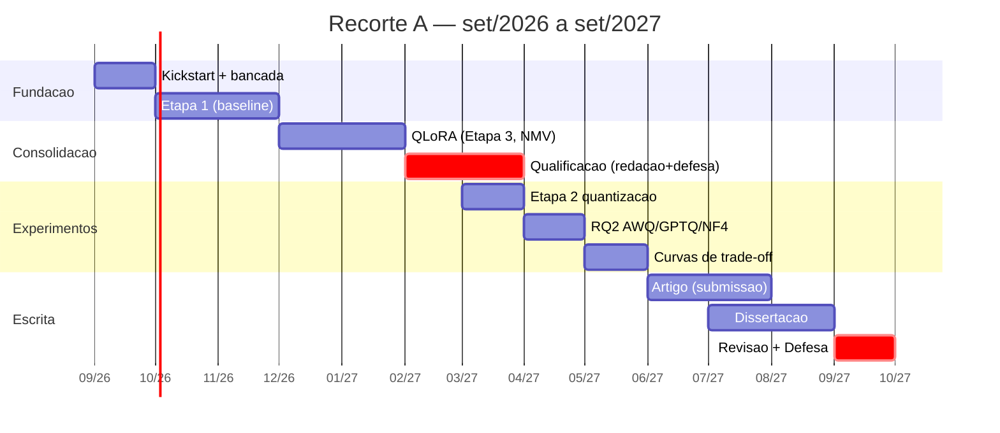

# RECORTE A — Cronograma até a defesa

**Cenário definido:** ~12 meses até a defesa · dedicação ~10h/semana · prazo da qualificação ainda a confirmar.
**Início:** set/2026 · **Defesa-alvo:** ~set/2027 · **Orçamento efetivo:** ~450–500 h no total.

> ⚠️ **Leitura honesta:** 12 meses a 10h/semana é apertado para o protocolo "médio" completo. Este cronograma foca num **Núcleo Mínimo Viável (NMV)** que já rende dissertação + artigo. As extensões (§ Extensões) só entram se houver folga. **Não tente fazer tudo** — a matriz completa (3 modelos × 5 precisões × robustez) é plano B.

---

## 0. COMECE POR AQUI (próximas 2 semanas — set/2026)

Isto cura o "estou perdido". Faça nesta ordem:

1. **Reunião com o orientador (semana 1).** Levar o `protocolo_experimental` e resolver 3 coisas: (a) **confirmar o prazo formal da qualificação** no PPGCC (define todo o resto); (b) aprovar o enquadramento custo×qualidade e os não-objetivos; (c) confirmar acesso/orçamento RunPod.
2. **Subir a bancada mínima (semanas 1–2).** RunPod: 1 pod, 1 GPU 24 GB; instalar Python/PyTorch/Transformers; baixar **um** modelo pequeno (comece pelo 3B para depurar barato) e o **PrimeVul**.
3. **Rodar 50 funções do PrimeVul-test em prompt (semana 2).** Escrever o laço de inferência + o **parsing robusto** da resposta ("sim/não") + a avaliação com scikit-learn (F1/precisão/revocação/FPR). Meta: um primeiro número, mesmo que feio.

Se ao fim de 2 semanas você tiver 1 número de F1 confiável em 50 funções, **você está no rumo**.

---

## 1. Marcos principais

| Marco | Alvo | O que entrega |
|---|---|---|
| M0 — Bancada pronta | out/2026 | Harness de inferência+avaliação funcionando no PrimeVul |
| M1 — Baseline confiável (Etapa 1) | nov/2026 | Tabela F1/FPR de 1–2 modelos em 16 bits + UniXcoder-FT |
| M2 — Resultados preliminares (QLoRA) | jan/2027 | 1–2 modelos especializados por QLoRA; VD-S/pareado |
| **M3 — QUALIFICAÇÃO** | **fev–mar/2027** | Fundamentação + problema + resultados preliminares |
| M4 — Comparação de quantização (RQ2) | mai/2027 | AWQ/GPTQ/NF4 sobre o modelo ajustado; curva de trade-off |
| M5 — Artigo submetido | jun–jul/2027 | Paper (workshop/conferência) com o resultado central |
| M6 — Dissertação escrita | ago/2027 | Texto completo revisado |
| **M7 — DEFESA** | **set/2027** | Apresentação e entrega final |

---

## 2. Cronograma mês a mês

| Mês | Período | Foco | Entregável |
|---|---|---|---|
| 0 | set/2026 | Kickstart (§0): orientador, prazos, bancada | Ambiente + 1º número em 50 funções |
| 1 | out/2026 | **Etapa 1**: laço completo, PrimeVul-test inteiro, 16 bits | Baseline de 1–2 decoders + UniXcoder-FT |
| 2 | nov/2026 | Consolidar baseline; conferir contra a literatura (StarCoder2 ≈ F1 baixo no PrimeVul) | Tabela de referência confiável |
| 3 | dez/2026 | **Etapa 3 (NMV)**: QLoRA + cabeça de classificação em **1** modelo (Qwen2.5-Coder-7B) | 1 modelo especializado + VD-S/pareado |
| 4 | jan/2027 | 2º modelo QLoRA (StarCoder2-7B); começar a escrever a qualificação | Resultados preliminares p/ qualificação |
| 5 | fev/2027 | **Redação + defesa da qualificação** | Texto de qualificação |
| 6 | mar/2027 | Qualificação (se o prazo permitir) + **Etapa 2**: quantizar (NF4) e medir custo | Custos de inferência (memória/latência/energia) |
| 7 | abr/2027 | **RQ2**: comparar **AWQ vs GPTQ vs NF4** (4 bits) sobre o modelo ajustado | Qualidade×método de quantização |
| 8 | mai/2027 | **Etapa 5**: montar curvas de trade-off, achar o "joelho", recomendação | Curva custo×qualidade + recomendação |
| 9 | jun/2027 | **Escrever o artigo** (resultado central) e submeter | Paper submetido |
| 10 | jul/2027 | Redação da dissertação (capítulos de método e resultados) | Rascunho da dissertação |
| 11 | ago/2027 | Fechar dissertação; extensões só se houver folga (robustez, 3º modelo) | Dissertação revisada |
| 12 | set/2027 | Revisão final, slides, **defesa** | Defesa |

---

## 3. Núcleo Mínimo Viável (NMV) — o que é inegociável

Se o tempo apertar, garanta **só** isto (ainda é uma dissertação completa e defensável):
- **2 modelos** de código (Qwen2.5-Coder-7B, StarCoder2-7B) + **UniXcoder-125M** baseline.
- **3 precisões**: 16 bits (referência) vs **4 bits {NF4, AWQ, GPTQ}**. (8 bits e GGUF viram extensão.)
- **Métricas completas**: F1, FPR, VD-S, acurácia pareada + custo (VRAM, latência, energia, US$).
- **3 seeds** só na comparação-cabeça (RQ2); nos secundários, 1 seed.
- **Etapa 4 (contaminação)**: 1 demonstração Big-Vul → PrimeVul.

### Extensões (só se sobrar tempo)
DeepSeek-Coder-6.7B (3º modelo) · 8 bits · GGUF/edge · **robustez (RQ3)** · QA-LoRA vs merge+PTQ · benchmark temporal extra.

---

## 4. Trilha do artigo

- **De onde sai:** o resultado central de RQ2 + a curva de trade-off (M4/M8). É autocontido e publicável mesmo se o QLoRA não melhorar a qualidade.
- **Quando escrever:** jun–jul/2027, reaproveitando os capítulos de método/resultados da dissertação (escreva a dissertação em inglês modular para facilitar).
- **Onde submeter:** priorizar **workshop/venue de turnaround rápido** (ex.: workshops de MSR/ICSE, ou trilha de SE/segurança) em vez de conferência top — o prazo de 12 meses não comporta ciclo longo de revisão. Conferir deadlines reais antes.
- **Regra:** o artigo é subproduto, não pode atrasar a dissertação.

---

## 5. Ritmo semanal sugerido (~10h)

- **6h "mão na massa"** (código/experimentos) em 1–2 blocos protegidos por semana.
- **2h leitura/anotação** (fechar lacunas de fundamentação; manter o dossiê atualizado).
- **2h escrita** contínua (não deixar a redação toda para o fim — escreva método e resultados **enquanto** faz).
- Registrar tudo numa planilha desde o dia 1 (modelo, precisão, prompt, seed, métrica, custo, instância).

---

## 6. Riscos e amortecedores

| Risco | Amortecedor |
|---|---|
| **Parsing da resposta consome semanas** | Começar com 50 funções; fixar temperatura 0; testar regex cedo. |
| **Prazo da qualificação desconhecido** | Resolver na 1ª semana com o orientador (item nº1). |
| **10h/semana escorregam** | Blocos protegidos na agenda; NMV como escopo real, resto é bônus. |
| **Depuração de GPU/quantização** | Depurar no 3B barato; AWQ/GPTQ só depois do fluxo estável. |
| **Redação empurrada para o fim** | 2h de escrita/semana desde já; reusar texto no artigo. |
| **Escopo incha** | Não-objetivos (§8 do protocolo) são lei; extensões só com folga. |

---

## 7. Visão geral (Gantt)

---

## 8. Primeiro passo, em uma frase

**Marque a reunião com o orientador esta semana** (confirmar prazo da qualificação) e **suba o PrimeVul com um modelo 3B para tirar o primeiro F1 em 50 funções**. O resto do cronograma se destrava a partir daí.
